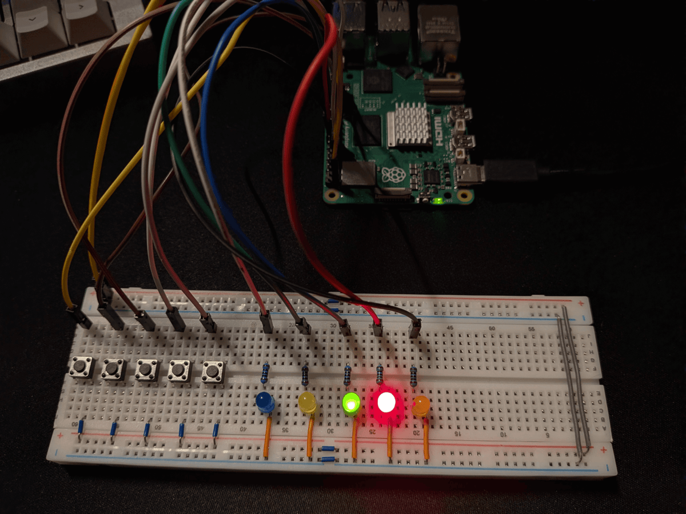

# System sterowania oświetleniem z Raspberry Pi

Projekt pokazuje prosty system do sterowania „oświetleniem domowym" (symulowanym diodami LED) przy użyciu Raspberry Pi 5. Sterowanie odbywa się przez stronę WWW, a system zapisuje historię zmian.

## Jak to działa

* Backend działa na Raspberry Pi i steruje GPIO (`gpioget`, `gpioset`, `gpiomon`).
* Frontend łączy się z backendem i pokazuje listę świateł oraz ich stan.
* Dane konfiguracji i historia są w SQLite.

## Sprzężenie zwrotne

System po zmianie stanu **nie zakłada**, że wszystko zadziałało:

1. Ustawia stan na GPIO (`gpioset`),
2. **Odczytuje stan z pinu** (`gpioget`),
3. Ten odczytany stan zwraca do UI i zapisuje w historii.

Czyli stan w aplikacji i w logach wynika z **realnego odczytu**, a nie tylko z polecenia „włącz".
